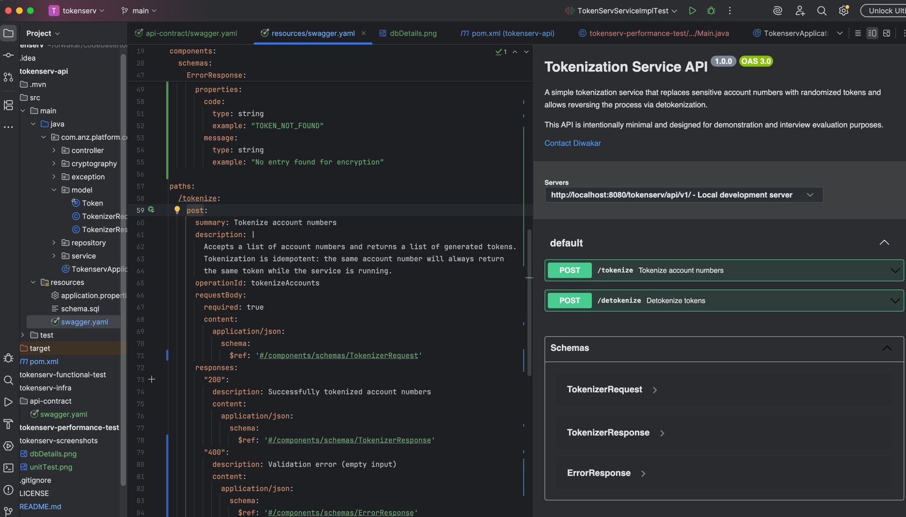
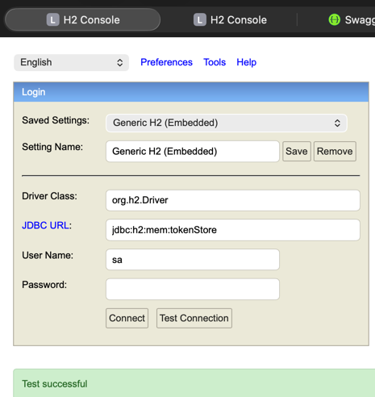
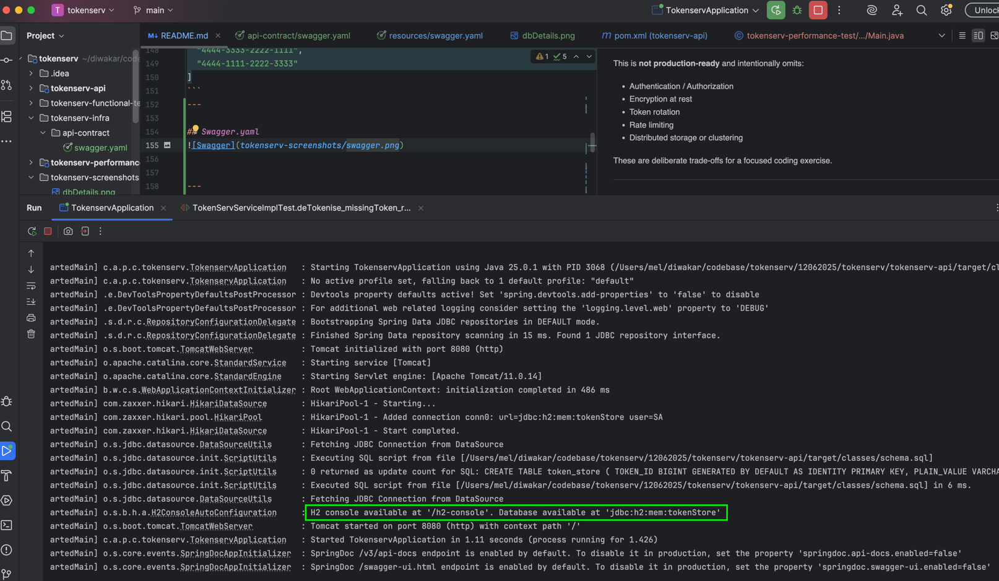
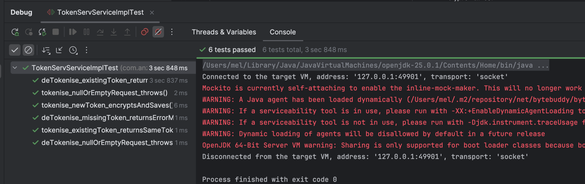
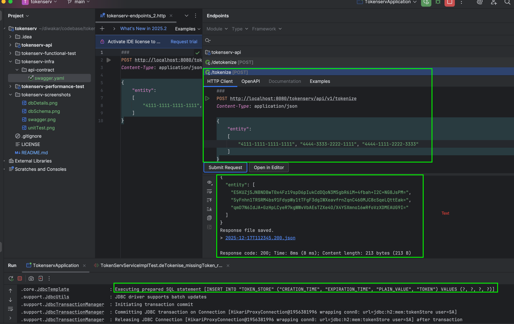
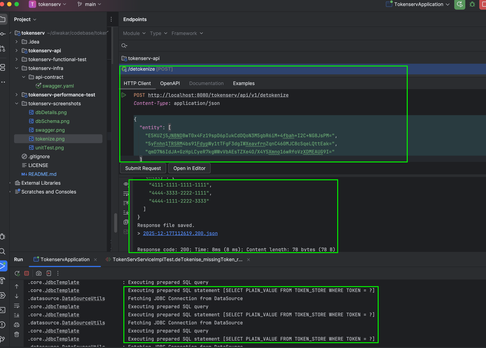

# tokenserv - Tokenization Service

A simple Spring Boot–based tokenization service that replaces sensitive account numbers (e.g. payment card or bank account numbers) with randomized tokens and allows reversing the process via detokenization.

This project is intentionally **simple, readable, and interview-focused**. It demonstrates clean API design, basic persistence, and unit testing without unnecessary production complexity.

---

## 📌 Purpose

Tokenization is used to protect sensitive data by replacing it with a token that has **no intrinsic value**. The original data can only be retrieved by systems that have access to the token mapping.

This service:

* Accepts a collection of account numbers
* Generates and stores tokens for them
* Allows tokens to be swapped back to the original values

---

## 🧱 Technology Stack

* Java 17+
* Spring Boot
* Spring Web (REST APIs)
* Spring Data JPA
* H2 In-Memory Database
* JUnit 4 (unit testing)
* Maven

---

## 🏗️ Architecture Overview

* **Controller layer** – Exposes REST endpoints
* **Service layer** – Handles tokenization and detokenization logic
* **Repository layer** – Persists token ↔ account mappings
* **H2 in-memory DB** – Stores mappings for the lifetime of the application

Design principles followed:

* Single Responsibility Principle
* Clear separation of concerns
* No overengineering
* Easy to test and reason about

---

## 🚀 Running the Application Locally

### Prerequisites

* Java 17 or later
* Maven 3.8+

### Start the service

```bash
./mvnw spring-boot:run
```

The application will start on:

```
http://localhost:8080
```

---

## 📖 API Documentation (Swagger / OpenAPI)

This service exposes an OpenAPI (Swagger) definition for easy exploration and testing of the REST endpoints.

### Swagger UI

Once the application is running, access the Swagger UI at:

```
http://localhost:8080/swagger-ui.html
```

### OpenAPI Specification

The OpenAPI JSON definition is available at:

```
http://localhost:8080/v3/api-docs
```

---

### API Overview

| Method | Endpoint      | Description                      |
| ------ | ------------- | -------------------------------- |
| POST   | `/tokenize`   | Tokenize account numbers         |
| POST   | `/detokenize` | Convert tokens back to originals |

---

## 🔌 API Endpoints

### 1️⃣ Tokenize

**POST** `/tokenize`

**Request Body**

```json
[
  "4111-1111-1111-1111",
  "4444-3333-2222-1111",
  "4444-1111-2222-3333"
]
```

**Response**

```json
[
  "fvMymE7X0Je1IzMDgWooV5iGBPw0yoFy",
  "L4hKuBJHxe67ENSKLVbdIH8NhFefPui2",
  "ZA5isc0kVUfvlxTE5m2dxIY8AG76KoP3"
]
```

---

### 2️⃣ Detokenize

**POST** `/detokenize`

**Request Body**

```json
[
  "fvMymE7X0Je1IzMDgWooV5iGBPw0yoFy",
  "L4hKuBJHxe67ENSKLVbdIH8NhFefPui2",
  "ZA5isc0kVUfvlxTE5m2dxIY8AG76KoP3"
]
```

**Response**

```json
[
  "4111-1111-1111-1111",
  "4444-3333-2222-1111",
  "4444-1111-2222-3333"
]
```
---

## Swagger.yaml 



## Postman Collection:
### Location : /tokenserv-infra/api-contract/tokenServ.json


---

## 🗄️ In-Memory Database

* Uses **H2** in-memory database
* Data exists only while the application is running
* Automatically created and destroyed on startup/shutdown

Optional H2 Console:

```
http://localhost:8080/h2-console
```

## Credentials:


## App startup Schema:


---

## 🧪 Testing

Unit tests are provided for the service layer to verify:

* Token generation
* Idempotent tokenization
* Correct detokenization

Run tests using:

```bash
./mvnw test
```

## UnitTest Results:


## Sample Data Screenshot of Payload and response:

### Tokenize endpoint


### De-Tokenize endpoint


---

## ⚠️ Known Limitations (By Design)

This is **not production-ready** and intentionally omits:

* Only unit test. No functional or performance tests.
* No authentication / authorization 
* Encryption at rest
* Max token size for Token generation
* Rate limiting
* Distributed storage or clustering

These are deliberate trade-offs for a focused coding exercise.

---

## 🔮 Potential Future Enhancements

* Introduce idempotency keys
* Header misses the correlation_Id
* Add token rotation policies
* Replace H2 with Redis or a secure datastore
* Add additional request validation and error handling
* Option to select encryption algorithm
* Horizontal scaling support

---

## ✅ Summary

* Simple and basic implementation
* Easy to run and verify locally
* Designed for discussion and extension during interviews

---

## 👤 Author


## Contact details:

---
- **Name:** Diwakar Barnes
- **LinkedIn:** https://www.linkedin.com/in/diwakar-b-00379547/
---
